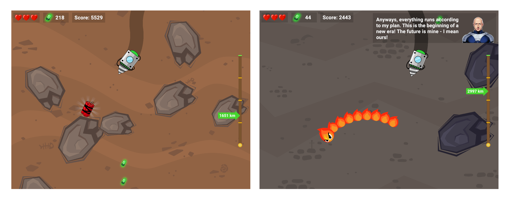
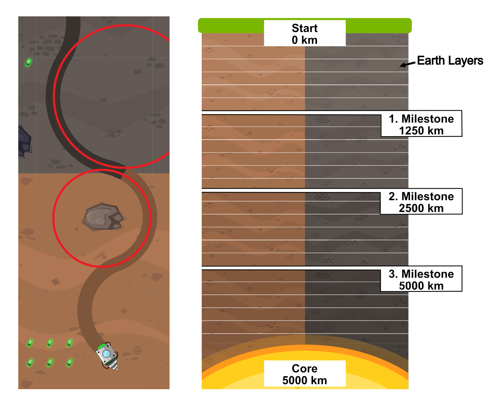
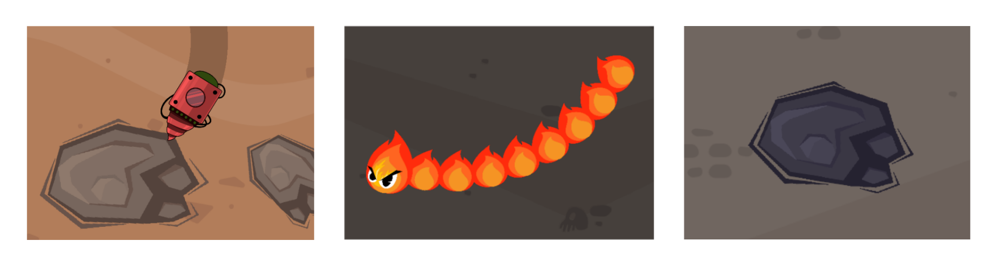
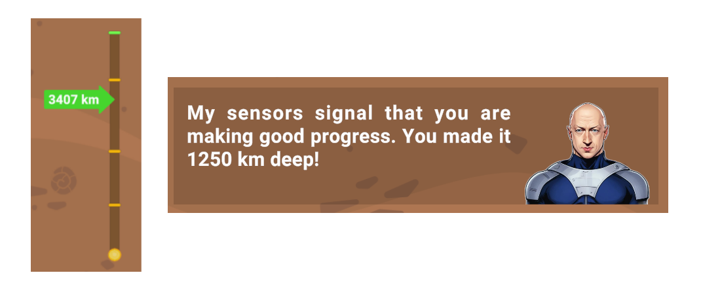
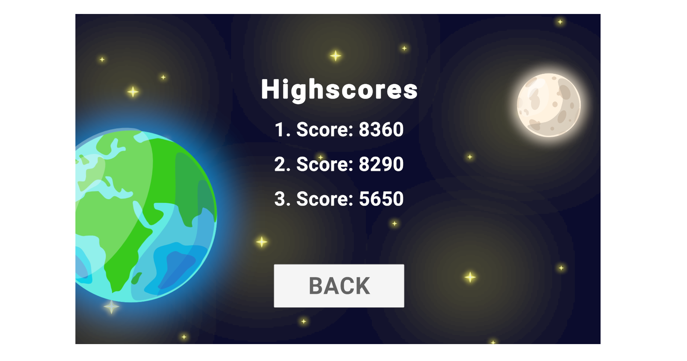

### Project Overview

D.R.I.L.L. is a published one-button arcade game that was developed as part of a university course on serious games. The project emphasizes creative problem-solving, collaborative development, and full production ownership, from concept to public release. The project tasks were defined in a very open-ended way, allowing to explore, design, and implement creative solutions beyond the basic requirements. The project demonstrates strong competencies in game systems design, real-time mechanics, UI feedback, performance optimization, and iterative polishing---all skills highly relevant for user-faced software and interactive systems.

The game was published on itch.io, completing the full development lifecycle from initial prototype to a publicly released final product. The game is available to play for free at: https://games-bond.itch.io/drill

### Concept & Narrative

Players take on the role of a hero, serving the mysterious Zark Muckerberg, whose risky plan is to drill to the Earth's core---triggering a global catastrophe that forces humanity to evacuate to a moon station.

The exaggerated narrative, sets the tone for a satirical but focused gameplay experience, combining humor with increasing mechanical challenge.

### Core Gameplay Mechanics

D.R.I.L.L. is built around a single-input control scheme with deceptively deep mechanics:

- The drill continuously moves downward
- Press & hold → drill curves right
- Release → drill curves left
- The curvature radius dynamically changes depending on the current underground layer

This design introduces strategic depth under extreme simplicity, forcing players to plan movements while reacting to changing terrain and obstacles.

### Technical Focus & Implemented Systems

#### Progression & Scoring
We implemented scoring and progression to motivate the player:
- Score increases with drilling depth
- Real-time UI feedback for depth and score
- Three milestone depths unlock narrative events

#### Obstacle System
We introduce obstacles to add difficulty and challenge the player:
- Static obstacles: rocks of varying size
- Dynamic obstacles: fire worms moving in circular paths
- Collision system with a three-hit failure condition

#### Milestones & Narrative Feedback

We added narrative reinforcement without interrupting gameplay flow:
- At predefined depths, players receive messages from Zark Muckerberg
- Dialog system implemented as UI overlays
- Integrated AI-generated voice lines for narrative delivery

#### Custom Features & Polish

To go beyond the base requirements, we designed and implemented additional features to add tactical decisions and replay value:
- **Collectibles:** Uranium items that boost score
- **Environmental Interaction:** Dynamite explodes on contact, clearing obstacles within a radius
- **High Score Leaderboard:** Providing a clear performance metric and encouraging self-competition
- **Story Telling:** Add intro and outro sequences to improve the user experience

#### Performance & Optimization

We optimized the performance particularly important for lower-end hardware and browser-based play:
- Implemented object lifecycle management
- Automatic cleanup of obstacles and terrain layers once they leave the screen
- Ensured stable performance throughout the play sessions

### Collaboration & Development Process

The project required tight coordination between mechanics, UI, audio, and performance considerations:
- Group-based development with clear task ownership
- Iterative milestone-driven workflow
- Balanced technical implementation with creative experimentation
- Continuous testing and tuning

### Key Takeaways
- Proven ability to ship a complete, polished interactive product
- Strong collaboration and communication in a team setting
- Creativity under design constraints, translating abstract requirements into concrete systems
- Practical data management experience, creating and managing assets such as audio files, sprites, and UI elements
- Creative use of AI-assisted tools for story and voice generation
- Practical understanding of iterative development and player-centric design
