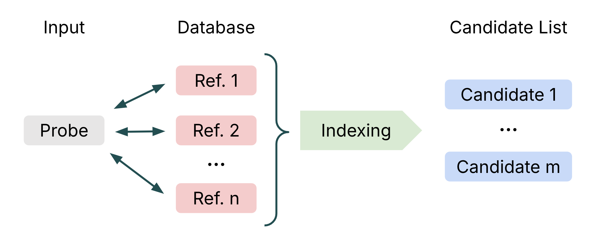
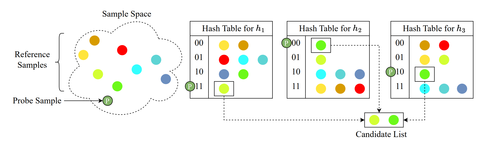
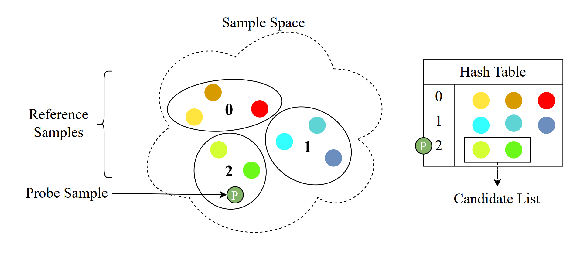
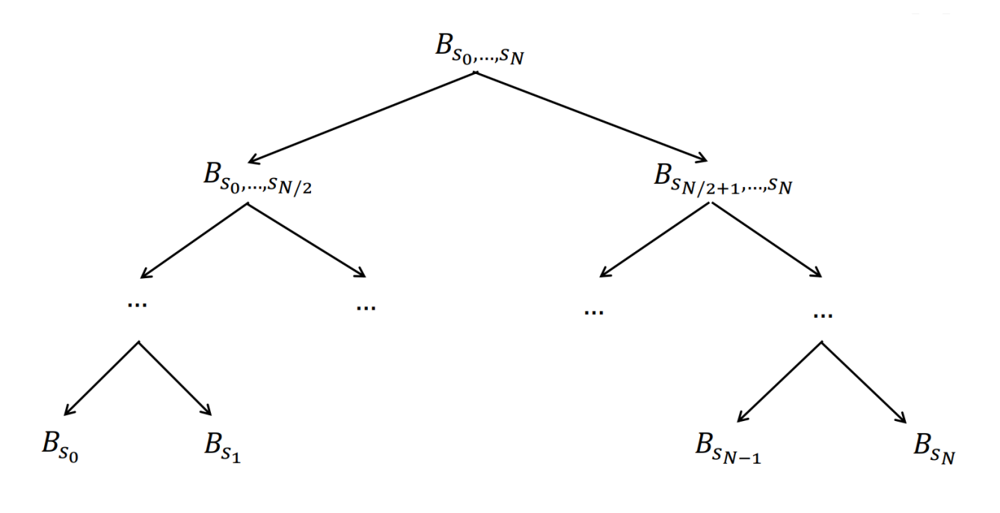
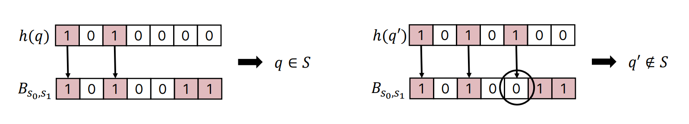
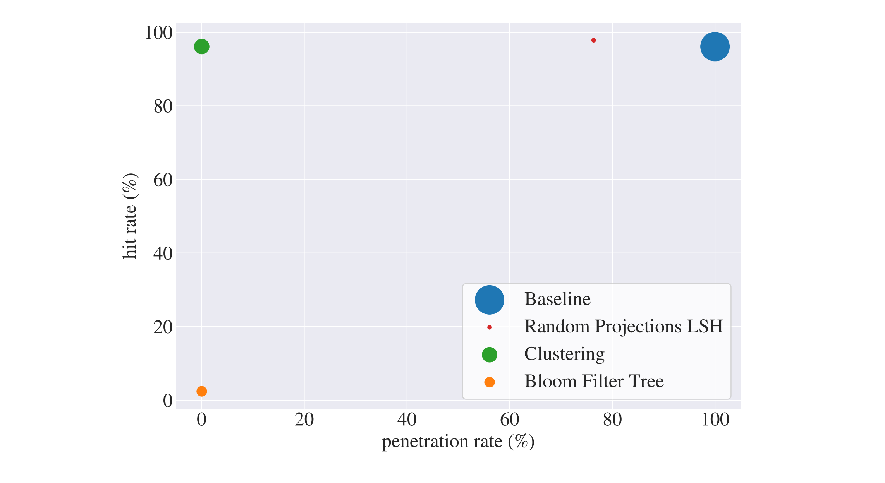

### Project Overview

This project explores efficient indexing strategies for large-scale biometric identification systems and was developed as part of the university course on Human and Identity-Centric Machine Learning. Biometric systems rely on unique traits, such as fingerprints, iris patterns, or facial features, to verify individuals. As databases grow, exhaustive search methods become computationally expensive and slow, while error rates increase. This project investigates indexing techniques that reduce search space while maintaining accuracy, enabling faster and scalable identification suitable for real-world applications.

**Core contribution**: We implemented and evaluated four approaches—baseline, Locality Sensitive Hashing (LSH), clustering, and bloom filter trees—comparing performance on hit rate, penetration rate, and computational efficiency.

### Motivation

- Biometric identification is increasingly adopted across industries.
- Efficient search is critical: naive exhaustive search becomes impractical as the number of identities increases.
- Indexing strategies improve both speed and scalability without sacrificing accuracy.
- Practical applications include security systems, identity verification, and large-scale user authentication.

### Problem Statement

Given a biometric probe sample and a database of n reference samples, the system must return a candidate list of m samples (m <\< n) likely to match the probe.

Challenges include:
- Biometric data has no natural ordering, preventing simple indexing
- Data is fuzzy: sensor variations, aging, facial expressions, and lighting affect reliability
- High-dimensional feature representations require computationally efficient search methods

Goal: maximize the **hit rate** while minimizing the **penetration rate**, balancing speed and accuracy.

### Approaches

#### Exhaustive Search (Baseline)
- Compute cosine distance between probe and all reference samples
- Optional random subset reduces computation but may miss correct matches
- Serves as performance reference for other methods

#### Locality Sensitive Hashing (LSH)
- Projects high-dimensional data into lower dimensions using random projections, preserving similarity
- Data points are assigned to buckets; similar samples are likely to fall in the same bucket
- Efficient approximate nearest neighbor search for large datasets

#### Clustering (k-means++) 
- Groups similar reference samples into clusters
- Probe sample is assigned to a cluster; candidate list contains cluster members
- Reduces search space significantly
- Trade-off: fewer candidates improve speed but risk missing matches

#### Bloom Filter Tree
- Hierarchical structure of probabilistic bloom filters
- Bloom filters can test membership efficiently; guarantees no false negatives, tolerates some false positives
- Bloom filters are used to decide which subtree to descend
- Suitable for space-efficient indexing

### Evaluation
- Dataset: 3,531 reference samples, 19,557 probe samples, 1024-dimensional features
- Metrics:
  - **Hit rate**: proportion of correct identities returned
  - **Penetration rate**: proportion of database examined
  - **Computational time**

### Key Findings
- Clustering achieved highest hit rate, but with higher identification time
- LSH balanced speed and accuracy effectively
- Bloom filter tree improved computational efficiency, but achieved slightly lower accuracy
- Baseline had the slowest computation and serves as a clear benchmark

### Takeaways
- Clustering and LSH approaches outperform baseline in both accuracy and speed
- Trade-offs exist between computational time and search accuracy
- The project demonstrates practical skills in:
  - **High-dimensional similarity search**
  - **ML-based indexing and clustering**
  - **Algorithmic evaluation for applied systems**
- Methods explored are directly applicable in real-world biometric systems, identity verification, and other ML-driven search problems

### Technology
- Machine Learning: k-means++ clustering, LSH
- Data Structures: Hash tables, bloom filters, tree structures
- Programming: Python, NumPy, pandas, scikit, scipy
