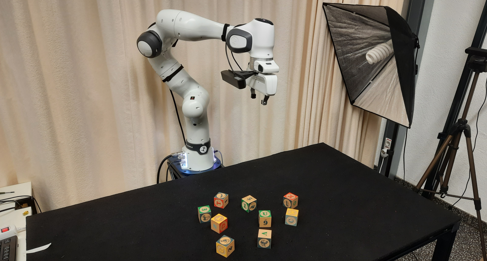
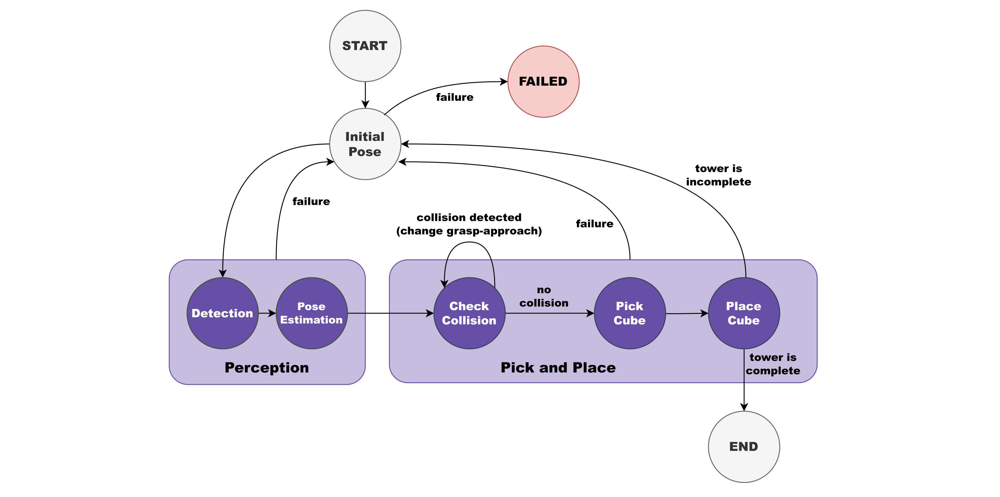
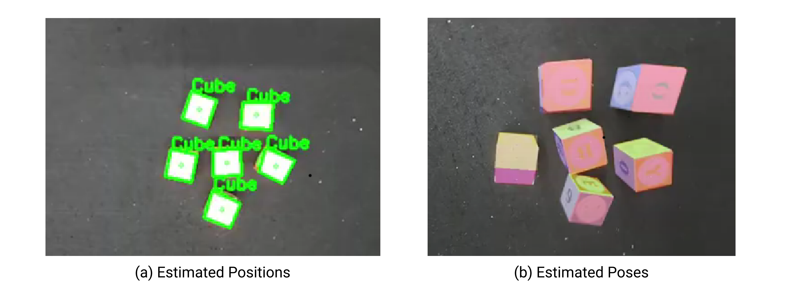
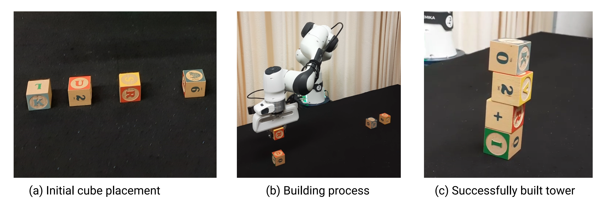
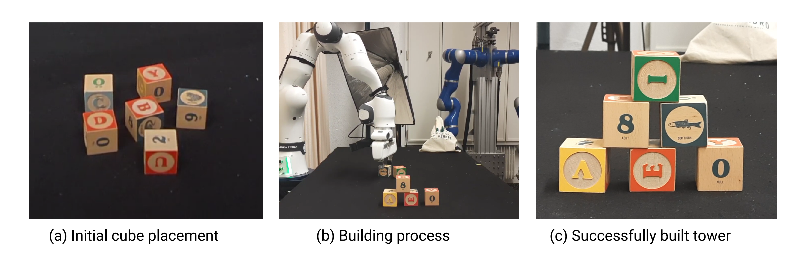

### Project Overview

This project focuses on designing and implementing a complete robotic manipulation pipeline that enables a robot arm to autonomously solve a pick-and-place task in a dynamic environment. The goal is to have the robot build a tower from multiple cubes that are randomly scattered on a table, while continuously adapting to changes in object positions and avoiding collisions.

The motivation behind this project was to gain hands-on experience with all major components of intelligent robotic manipulation---from perception and pose estimation to motion planning, grasping, and high-level control---and to understand how these components interact in a real system.

### Task Description

The robot is required to:
- Detect an arbitrary number of cubes placed randomly on a table
- Estimate their 6-DoF poses using onboard perception
- Select suitable target cubes for manipulation
- Pick and place cubes to build a tower of arbitrary structure
- Avoid collisions with the environment, the cubes, and the partially built tower
- Recover from errors and continue execution autonomously

The robot is equipped with a gripper end effector and an arm-mounted stereo camera, allowing perception and manipulation to be tightly coupled.

### System Setup & Technologies
- Robot: Franka Emika Panda (7 DoF)
- End Effector: Parallel gripper
- Perception: ZED2 stereo RGB-D camera (arm-mounted)
- Objects: Wooden cubes
- Software: ROS Noetic
- Languages: Python & C++
- Motion Planning: MoveIt
- Simulator: Gazebo
- Hardware: NVIDIA GPU system

### State Machine

To coordinate perception, planning, and manipulation, we designed a custom state machine that governs the robot's behavior and tracks task progress.

### Target Cube Selection
To decide which cube to manipulate next, we implemented and evaluated different selection strategies:
- Smallest Distance to End Effector
- Least Neighbors
- Smallest Distance to Closest Cube

### Perception Pipeline

#### Cube Detection

The detection pipeline consists of:
1. Preprocessing of RGB-D data
2. Processing though segmentation
3. Feature extraction and shape analysis
4. Transformation from image coordinates to camera coordinates

This provides rough 3D estimates of the cube positions.

#### Pose Estimation

To recover precise 6-DoF poses, we use Iterative Corresponding Geometry (ICG), a fast and accurate RGB-D–based pose tracking method. Given object geometry and initial pose estimates, ICG efficiently refines position and orientation estimates in real time.

#### Multi-Instance Pose Estimation

Although the cubes differ in color patterns, they share identical geometry. We therefore treat all cubes as instances of the same object class. Multi-instance pose estimation is achieved by:

1. Initializing ICG with all detected cube positions
2. Assigning a fixed initial orientation
3. Running the tracker to converge to the correct poses

This simplifies the pipeline while remaining sufficient for the manipulation task.

### Motion Planning & Grasping

Motion planning is handled using MoveIt, which provides collision-free trajectory planning based on a dynamically updated planning scene.

")

Key aspects include:
- Continuous updates of cube poses in the planning scene
- Collision avoidance with the robot, table, cubes, and tower
- Sampling-based planning for safe trajectories

To increase robustness, the system supports six different grasping strategies, allowing the robot to adapt when a particular grasp is infeasible due to collisions or kinematic constraints.

### Experiments & Results

We evaluated the system on two different tower-building tasks:

- **Straight Tower**: Four cubes stacked vertically, starting from a structured initial layout. The robot successfully completed the task using a cube selection strategy that picks cubes that are most isolated.

- **Pyramid Structure**: A more complex arrangement with randomly placed, densely packed cubes. Despite the increased difficulty, the robot was able to build the pyramid reliably using an selection strategy that selects the cube that has the smallest distance to the end effector.

Both experiments demonstrate that the system can adapt to different layouts, handle perception to estimate cube poses, and plan collision-free motions throughout the manipulation process.

### Key Takeaways

- Designed a fully integrated manipulation pipeline from perception to execution
- Gained practical experience with ROS, MoveIt, and real robot hardware
- Collected hand-on experience with image processing and computer vision methods
- Learned how to build robust state machines for autonomous robotic behavior
- Explored the gap between simulation and real-world execution