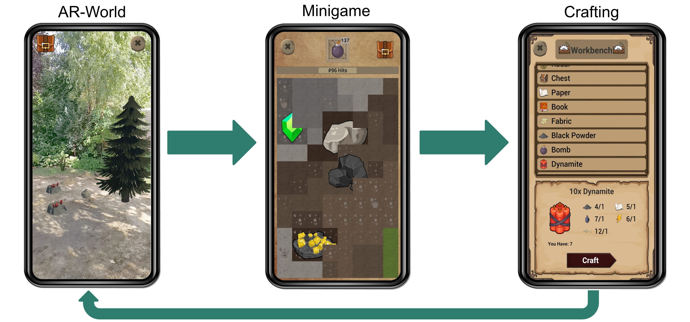
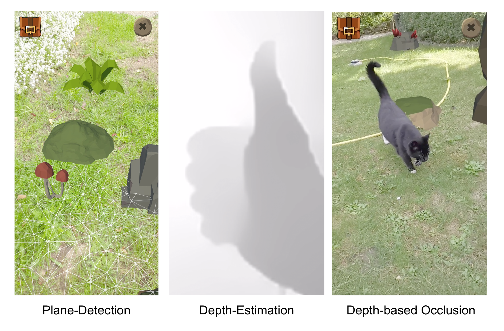
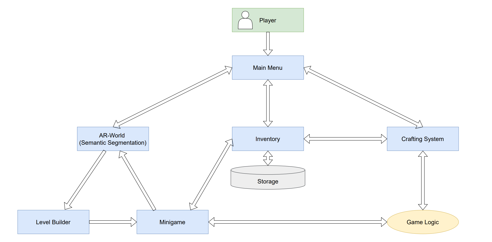

### Project Overview

Lightyears Ahead is a mobile augmented reality (AR) serious game developed as part of a university practical course on serious games. This project combines computer vision, AR, and game systems to motivate players to explore the real world outdoors while interacting with a game that adapts to the physical environment using semantic segmentation. By embedding gameplay directly into the player's surroundings, the game encourages physical movement, exploration, and engagement with the environment.

### Serious Game

A serious game is a game designed not only for entertainment, but also to promote additional real-world benefits such as learning, awareness, or behavioral change. Unlike traditional mobile games, Lightyears Ahead:
- Requires players to move outdoors
- Integrates real-world surfaces and objects into gameplay
- Encourages physical activity as a core mechanic
- Uses AR as a gameplay driver

The player explores their environment, discovers resources in the real world via AR, and uses them in a progression-based crafting system---blending play, movement, and perception.

### Gameplay Concept

The game is a single-player exploration, collection, and crafting game for Android devices. It uses a closed gameplay loop where computer vision directly influences game mechanics.

1. Players scan their surroundings using their smartphone camera
2. The environment is semantically segmented into categories such as: Ground, Foliage, Sky, Water, etc.
3. Virtual resources appear on real-world surfaces depending on their semantic class.
4. Interacting with these AR objects launches context-dependent minigames.
5. Resources gathered are used for: crafting tools, upgrading equipment, and unlocking progression.

### Agile Development Process

- Agile development with weekly sprints
- Clearly defined milestones: Mockup → Alpha → Beta → Release
- Regular team meetings and task-based work distribution
- Delivered a fully functional Android 8+ build

### Technical Focus

The project was built using Niantic's Lightship AR Developer Kit (now Niantic Spatial SDK). It is a development toolset for building high-fidelity Augmented Reality (AR) and spatial computing applications integrated into Unity. Key technical components include:

#### Semantic Segmentation

- Classify the scene into semantic channels
- Determines directly which resources can appear, which minigame is triggered, and which tools are required

#### AR Integration
- Anchor 3D AR objects that serve as interactive objects
- Plane detection to find areas for object spawning
- Estimate depth of objects to enable or disable the interaction
- Depth-based occlusion to display objects in the real-world correctly

### System Architecture

The application follows an architecture that connects the core components with the game logic.

### AR World

- Primary interaction space
- Players physically move and scan their surroundings
- AR objects appear and act as entry points into minigames

  

### Key Challenges

- Designing gameplay that meaningfully leverages semantic scene understanding
- Error handling and inaccuracies in AR object placement
- Developing UI suitable for outdoor mobile use
- Balancing complex interdependent systems
- Adhering to the performance limitations
- Testing perception-driven systems outside controlled environments

### Results and Takeaways

This project demonstrates:
- Practical use of computer vision in interactive systems
- Integration of ML-powered perception into real-time applications
- Experience with AR constraints in outdoor conditions
- Strong system-level thinking across perception, interaction, and logic
- Ability to design and balance complex user-facing systems
- Agile development process and teamwork
