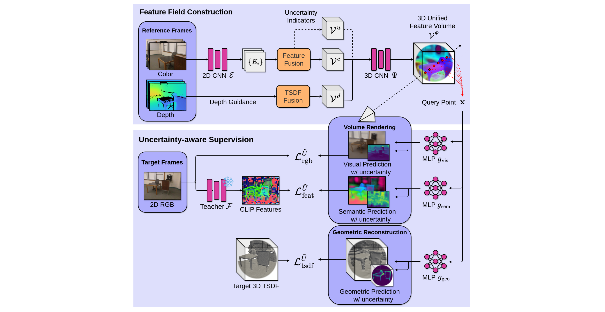
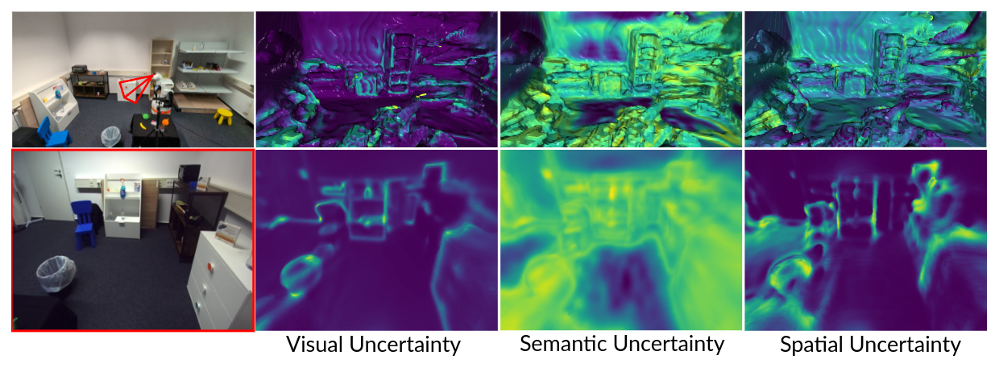

### Project Overview

Modern robots operating in real-world environments need more than accurate perception—they need to understand how reliable their perception is. UniFField is a research project that addresses this challenge by introducing a generalizable, uncertainty-aware 3D neural feature field that enables robots to build rich scene representations while reasoning about uncertainty in visual, semantic, and geometric information.

The core goal of this work is to support robust decision-making in unstructured and partially observable environments, such as cluttered indoor scenes, where sensor noise, occlusions, and incomplete observations are unavoidable.

### Motivation

Recent advances in 3D neural feature fields have made it possible to lift powerful pretrained 2D vision and vision–language features into 3D space. This has enabled applications such as language-guided navigation and manipulation. However, existing approaches suffer from two major limitations:

- **Scene specificity**: Most methods are trained per scene and do not generalize to unseen environments.
- **Lack of uncertainty modeling**: Predictions are treated as equally reliable, even in noisy or partially observed regions.

For real robots exploring unknown environments, these limitations can lead to brittle behavior and poor decision-making.

### Approach

UniFField introduces a unified voxel-based 3D feature representation that jointly models:

- **Visual features**
- **Semantic features** distilled from pretrained vision–language models (VLMs)
- **Geometric features**
- **Uncertainty estimates** for each modality

The model is designed to be general-purpose and zero-shot applicable to new environments. As the robot explores a scene, UniFField incrementally integrates RGB-D observations into the feature field, continuously updating both feature predictions and their associated uncertainties.

Crucially, uncertainty is explicitly modeled to capture:
- **Aleatoric uncertainty** (noise, partial observability)
- **Epistemic uncertainty** (lack of prior knowledge in unseen scenarios)

This makes the representation particularly well suited for downstream tasks that require active perception and exploration.

### Key Contributions

- **Unified multi-modal representation**: A single 3D neural feature field that combines visual, semantic, and geometric information instead of treating them independently.
- **Uncertainty-aware perception**: The model predicts uncertainty per modality, enabling the robot to reason about the reliability of its perception in real time.
- **Generalizable and incremental**: Unlike NeRF- or Gaussian Splatting–based methods, UniFField supports incremental updates and can be applied zero-shot to new scenes.
- **Demonstration on mobile robot**: We devise a simple but effective approach to using the uncertainty-aware UniFField for an active object search task using a mobile manipulator robot.

### Results

Experimental results show that UniFField's predicted uncertainties accurately correlate with prediction errors in both scene reconstruction and semantic feature estimation. This demonstrates that the model not only produces meaningful features, but also reliable confidence estimates.
In a real-robot experiment, we demonstrate how uncertainty can be leveraged to perform active object search.
